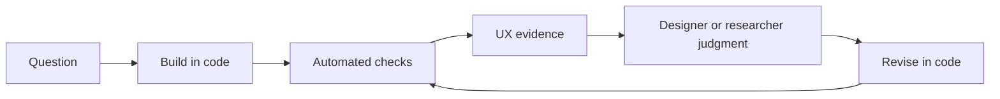
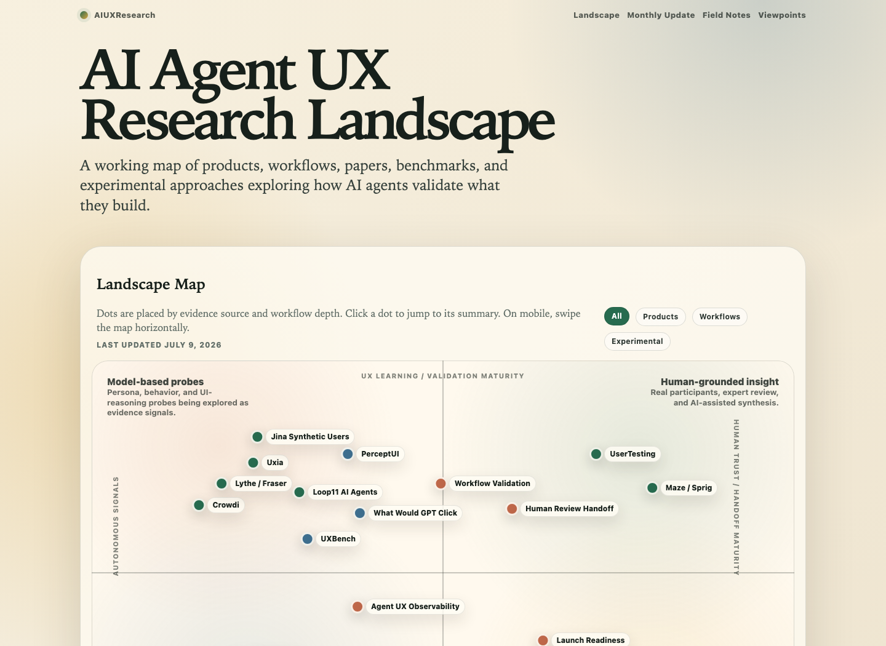

# AI Agent UX Research Platform

**Exploring how UX research and validation fit into AI-assisted build–test–iterate loops—and mapping the products and practices emerging around them.**

AI agents are shortening the distance between an idea, a coded interface, and the next revision. Designers are working more directly in code, and validation can now happen inside the build loop instead of waiting until a product feels “ready.” This repository is where I study what that changes about UX research.

The work has two parts.

## 1. Study the changing validation loop

I am looking at how teams can bring UX evidence into increasingly fast, code-centered product cycles:

The practical questions are:

- What can browser checks, model-based probes, and workflow telemetry tell us?
- Where do direct user evidence and experienced design judgment remain necessary?
- How should findings return to a coding agent or designer in a form they can act on?
- How do teams rerun validation without turning every iteration into a full research study?

## 2. Map the emerging landscape

As I study those loops, I am tracking the products, processes, papers, and experiments taking shape around them. The visual map places them on two dimensions:

- **Horizontal:** autonomous signals → human trust and handoff maturity
- **Vertical:** task execution and capability checks → UX learning and validation maturity

**[Open the interactive landscape →](https://mphaxise.github.io/ai-agent-ux-research-platform/)**

*The map is a working view of a fast-changing field, not a claim that the categories are settled.*

## Start here

- [Interactive landscape](https://mphaxise.github.io/ai-agent-ux-research-platform/) — the current two-by-two map, field notes, and source links
- [Workflow validation thesis](docs/workflow-validation-thesis.md) — one proposed build–validate–revise loop in detail
- [Human behavior modeling for agent UX](docs/human-behavior-modeling-for-agent-ux.md) — where model-based signals may help and where they remain weak
- [What we have done so far](docs/what-weve-done-so-far.md) — the research path, changes in direction, and current open questions

## Working stance

Automated and model-based signals can make some forms of UX validation faster, but they are not substitutes for people. The useful question is what each signal can detect reliably, how confident we should be in it, and when the loop should route to a designer, researcher, or participant.

Related work: [Design Skill Pack for AI Agent Coding Platforms](https://github.com/mphaxise/design-skill-pack-for-ai-agent-coding-platforms) · [Awesome Agent UX Research](https://github.com/mphaxise/awesome-agent-ux-research)
