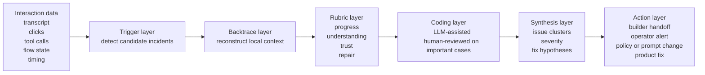

# Agent UX Observability

Context: this document reframes one branch of the opportunity. Some of what we are exploring is not classic UX research in the narrow sense. It is closer to `experience observability` for agentic systems, especially when the product is an agent that users interact with directly.

Legend:
- `Evidence-backed`: grounded in cited primary sources or official product docs.
- `Inference`: strategic synthesis.
- `Assumption`: unverified hypothesis.

## Working Definition

- `Inference | confidence: high` `Agent UX observability` means observing live agent interactions to detect, reconstruct, and explain UX-relevant incidents from the user's point of view.
- `Inference | confidence: high` The unit of analysis is not just a transcript and not just a page session. It is the combined loop of:
  - user messages or actions
  - agent responses
  - flow transitions
  - tool calls and outputs
  - user corrections and repair
  - outcome confidence or abandonment

## Major Conclusions

- `Evidence-backed | confidence: high` This is not a wholly novel problem shape. Adjacent fields already exist: digital experience monitoring, session replay, conversational analytics, dialogue-quality analysis, and human-AI interaction evaluation.
- `Inference | confidence: high` What looks new is combining those methods for agentic interaction loops where conversation, tools, and flow execution all matter at once.
- `Evidence-backed | confidence: medium` Research already supports several of the signals we care about: response relevance, dialogue helpfulness, user satisfaction, breakdown, repair, trust shifts, and the value of explicit micro-feedback.
- `Evidence-backed | confidence: high` LLM-assisted qualitative coding is plausible, but the HCI literature warns against treating it as methodologically self-validating.
- `Inference | confidence: medium` The right framing for this wedge is likely `observability + incident synthesis`, with UX research contributing the rubric and validation layer rather than defining the entire product.

## How This Differs From Adjacent Categories

| Category | Core question | Primary data | Typical output | Why it is not enough on its own |
|---|---|---|---|---|
| Classic UX research | What do target users need and how do they experience a concept or workflow? | Interviews, usability sessions, surveys, synthesis | Themes, findings, recommendations | Usually too slow and manually intensive for live agent loops |
| Product analytics | What do users do at aggregate scale? | Events, funnels, cohorts | Metrics and dashboards | Misses the local logic of breakdown and repair |
| QA / test observability | Did the system function correctly? | Test runs, assertions, logs | Pass/fail, failures, traces | Functional correctness does not explain trust, confusion, or effort |
| Conversational analytics | What happened in the conversation and what themes or sentiments are present? | Transcripts, audio, categories | Topics, sentiment, compliance, summaries | Usually weak on tool execution, flow logic, and repair behavior |
| Agent UX observability | Where did the user's experience break down, why, and what should be fixed? | Transcript plus flow state plus tool trace plus user reaction | Incident packets, severity, root-cause hypotheses, fix guidance | This is the synthesis layer we believe is missing |

## Adjacent Techniques We Can Borrow From

| Technique | What existing products or papers show | Relevance to our thesis | Basis |
|---|---|---|---|
| Digital experience monitoring | Elastic positions digital experience monitoring around synthetic journeys, real user monitoring, and SLOs from the user's point of interaction | Confirms that user-perspective observability is already a valid budget and tooling category | `Evidence-backed` |
| Session replay plus AI summaries | Fullstory's StoryAI can summarize sessions, identify key moments, and surface frustration signals from clicks, pages, and form events | Shows the market already accepts AI-assisted synthesis over behavioral traces | `Evidence-backed` |
| Conversational analytics | Google Conversational Insights and Amazon Connect conversational analytics analyze transcripts for sentiment, themes, interesting interactions, summaries, and issue categories | Confirms that conversation-level analytics is an accepted infrastructure layer | `Evidence-backed` |
| Qualitative dialogue analysis | Folstad and Taylor propose a framework for analyzing chatbot dialogues around response relevance and dialogue helpfulness | Gives us a strong methodological anchor for transcript-level coding | `Evidence-backed` |
| Satisfaction prediction from logs | Ay et al. show that conversation logs contain signal useful for predicting user satisfaction | Supports the idea that logs can drive triage even before explicit human review of every session | `Evidence-backed` |
| Breakdown and repair analysis | Breakdown and repair papers show trust and emotion can shift sharply after failure and partially recover later | Supports incident-based analysis instead of simple average quality scores | `Evidence-backed` |
| Human-AI interaction rubrics | Microsoft HAI guidelines focus on expectation setting, efficient correction, uncertainty handling, and feedback loops | Useful as rubric components for scoring agent behavior | `Evidence-backed` |
| LLM-assisted qualitative coding | ACM's HCI workshop report says LLMs are increasingly used in coding and synthesis, but need explicit standards and human oversight | Useful for method guardrails and product design | `Evidence-backed` |

## Signals That Matter In An Agentic Interaction

| Signal family | Example indicators | Why it matters |
|---|---|---|
| Goal progress | task completion, no-progress loops, repeated detours, abandonment | The most basic question is whether the user got closer to the goal |
| Understanding quality | user reframing, repeated corrections, conflicting interpretations | This is where intent understanding or planning breaks first |
| Tool and flow quality | tool retries, fallback chains, branch divergence, dead-end state transitions | Agentic UX depends on execution, not only on dialogue |
| Trust and confidence | explicit distrust, hesitation language, double-checking, opt-out, follow-up verification | Users may finish a task and still not trust the outcome |
| User effort | long clarification burden, manual recovery steps, excessive back-and-forth | High effort can make a technically successful flow still feel bad |
| Repair behavior | agent acknowledges failure, scopes down, suggests alternatives, successfully recovers | Recovery quality often matters more than perfection |
| Tone and social fit | strange tone, rudeness, invasiveness, over-proactivity | Some failures are relational rather than purely functional |
| Explicit feedback | thumbs, confidence checks, post-turn rating, post-task comment | Lightweight feedback greatly improves interpretation quality |

## A Practical Method Stack

## Recommended Framing For Our Product Exploration

- `Inference | confidence: high` Call this branch `Agent UX Observability`.
- `Inference | confidence: medium` Treat UX research as the methodological backbone:
  - rubric design
  - validation of coding quality
  - qualitative interpretation
  - study design when deeper human inquiry is needed
- `Inference | confidence: medium` Treat observability as the product delivery mode:
  - capture live traces
  - detect incidents
  - synthesize patterns
  - hand findings back to operators or builder agents

## Method Guardrails

- `Evidence-backed | confidence: high` Do not rely on unconstrained "AI summaries" as the whole method.
- `Evidence-backed | confidence: high` Keep an explicit rubric or codebook for what counts as misunderstanding, no-progress loops, trust drops, and successful repair.
- `Evidence-backed | confidence: high` Preserve human review for ambiguous, high-stakes, or privacy-sensitive incidents.
- `Evidence-backed | confidence: high` Be explicit about privacy, retention, redaction, and whether humans ever inspect raw logs.
- `Inference | confidence: medium` Separate descriptive analysis from fix recommendations so teams can see both the evidence and the interpretation.

## Implication For Our Two Main Wedge Directions

| Wedge | How agent UX observability shows up |
|---|---|
| Workflow validation for AI-generated apps | As a pre-ship observability loop over task completion, clicks, timings, and post-task ratings |
| OpenClaw-style personal-agent analysis | As a live incident-analysis loop over transcript, flow transitions, tool traces, and user repair behavior |

## What Is Still Unknown

1. `Assumption | confidence: low` Will buyers perceive this as a category worth paying for, or merely as a feature inside broader agent analytics?
2. `Assumption | confidence: low` Which signal mix matters most early: passive traces, explicit micro-feedback, or human-coded examples?
3. `Assumption | confidence: low` How much incident detection can be trusted before buyers demand human review?
4. `Assumption | confidence: low` Is the strongest wedge pre-ship workflow validation or live post-ship agent incident analysis?

## Source Notes

- [Elastic Digital Experience Monitoring](https://www.elastic.co/observability/digital-experience-monitoring)
- [Elastic Synthetic Monitoring docs](https://www.elastic.co/docs/solutions/observability/synthetics)
- [Elastic Real User Monitoring docs](https://www.elastic.co/docs/solutions/observability/apm/apm-agents/real-user-monitoring-rum)
- [Fullstory Session Replay](https://help.fullstory.com/hc/en-us/articles/360020828573-Getting-Started-with-Session-Replay)
- [Ask StoryAI in Session Replay](https://help.fullstory.com/hc/en-us/articles/36703158834583-Ask-StoryAI-in-Session-Replay)
- [Google Conversational Insights docs](https://cloud.google.com/contact-center/insights/docs)
- [Amazon Connect conversational analytics announcement](https://aws.amazon.com/about-aws/whats-new/2025/11/amazon-connect-conversational-analytics/)
- [Investigating the user experience of customer service chatbot interaction: a framework for qualitative analysis of chatbot dialogues](https://www.sintef.no/en/publications/publication/1962006/)
- [Conversation logs as a source of insight: Predicting user satisfaction for customer service chatbots](https://www.sintef.no/en/publications/publication/2372685/)
- [Conversational Repair in Chatbots for Customer Service: The Effect of Expressing Uncertainty and Suggesting Alternatives](https://www.sintef.no/en/publications/publication/1810622/)
- [Understanding the user experience of customer service chatbots: What can we learn from customer satisfaction surveys?](https://www.sintef.no/en/publications/publication/1962107/)
- [Guidelines for Human-AI Interaction](https://www.microsoft.com/en-us/research/articles/guidelines-for-human-ai-interaction-eighteen-best-practices-for-human-centered-ai-design/)
- [The State of Large Language Models in HCI Research: Workshop Report](https://interactions.acm.org/archive/view/january-february-2025/the-state-of-large-language-models-in-hci-research-workshop-report)
