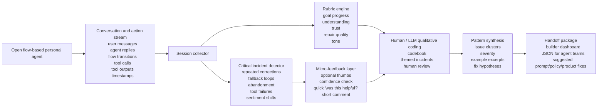

# Open Flow-Based Personal Agent UX Thesis

See also:
- [Agent UX Observability](./agent-ux-observability.md)
- [OpenClaw Service Landscape](./openclaw-service-landscape.md)

Framing: this is an alternate wedge direction for agents where the product is an open, flow-based personal agent. The concrete reference case here is `OpenClaw-style` personal agents. Instead of validating a generated app workflow, the product would analyze user-agent interactions plus flow execution traces to detect critical incidents, satisfaction shifts, and repair opportunities.

Legend:
- `Evidence-backed`: grounded in cited primary sources.
- `Inference`: strategic synthesis.
- `Assumption`: unverified hypothesis.

## Working Thesis

- `Inference | confidence: high` For open flow-based personal agents, the core UX is not only the conversation and not only the flow graph. It is the combined interaction loop between user intent, agent response, flow execution, tool use, and repair after failure.
- `Inference | confidence: medium` If OpenClaw is the reference product shape, then the most important evidence is likely to live in transcripts, flow transitions, user corrections, retries, and moments where the user has to recover the agent's behavior.
- `Evidence-backed | confidence: medium` Existing conversational-agent research already identifies useful dimensions for good and bad experiences: pragmatic utility, interpretation failures, hedonic delight, strange or rude responses, unwanted actions, trust changes after breakdown, and recovery after subsequent success.
- `Inference | confidence: high` This creates room for a product that turns conversation logs, flow events, and tool traces into structured UX insight for builders of open personal agents.
- `Assumption | confidence: medium-low` A strong first version may not need continuous monitoring of everything. It may only need to identify and analyze `critical incidents` in the conversation and return a compact diagnosis packet.

## What The Research Suggests We Should Look For

### Pragmatic quality

From chatbot and ChatGPT user-experience studies:

- useful and detailed information
- effective help with a task
- smooth task progress
- inability to help
- interpretation failures
- repeated clarification burden

### Hedonic and relational quality

From the same research line:

- delight, surprise, entertainment
- tone that feels strange, rude, or off
- unwanted contact or unwanted actions
- confidence and trust after the interaction

### Breakdown and repair dynamics

From breakdown research:

- where the breakdown happened
- whether it happened early or late in the session
- whether later successful turns repaired trust
- how sharply user emotion dropped after the incident

### Human-AI interaction quality

From Microsoft’s human-AI guidelines:

- whether the system set the right expectations
- whether it was clear what the system could do and how well
- whether correction was efficient
- whether the system scoped down or asked for clarification when uncertain
- whether the system encouraged granular feedback

## Seed Rubric For Conversation UX

This is a starting rubric, not a final standard.

| Dimension | What good looks like | What failure looks like | Basis |
|---|---|---|---|
| Goal progress | The user gets meaningfully closer to the goal each turn | The conversation loops, stalls, or drifts | `Inference` grounded in pragmatic UX studies |
| Understanding | The agent interprets the user correctly without repeated reframing | The user must restate intent or correct assumptions repeatedly | `Evidence-backed` + `Inference` |
| Helpfulness | The response is useful, specific, and actionable | The response is generic, evasive, or incomplete | `Evidence-backed` |
| Trust calibration | The agent signals uncertainty appropriately and does not overclaim | The user is misled into overtrust or loses trust due to opaque failures | `Inference` grounded in human-AI guidelines and breakdown research |
| Repair quality | After a failure, the system recovers or guides the user forward clearly | The conversation degrades further or forces the user to give up | `Evidence-backed` + `Inference` |
| Tone and social fit | The agent feels appropriate to context and user need | The agent feels rude, strange, robotic in the wrong way, or misaligned | `Evidence-backed` |
| User effort | The user can progress with low correction burden | The user does excess work to make the agent usable | `Inference` |
| Outcome confidence | The user leaves feeling the result is reliable enough to use | The user hesitates, double-checks, or abandons due to uncertainty | `Inference` |

## High-Level System Diagram

## Product Shape

### Inputs

- conversation transcript
- flow definition or flow-state trace
- tool/action trace
- metadata about task or agent role
- optional user feedback signals

### Analysis outputs

- critical incidents by session
- recurring issue clusters across sessions
- rubric scores by dimension
- evidence excerpts
- suggested fixes by layer:
  1. prompt/policy,
  2. tool selection,
  3. system behavior,
  4. UX copy or interaction design

## Why This Direction Could Work

- `Evidence-backed | confidence: medium` Researchers already use critical-incident-style reports and pragmatic/hedonic frameworks to analyze chatbot and ChatGPT experiences.
- `Evidence-backed | confidence: medium` Breakdown research shows trust and emotion can shift sharply when failures happen, especially depending on their order in the interaction.
- `Evidence-backed | confidence: medium` HCI researchers are already using LLMs to help with coding and thematic analysis, but they emphasize the need for explicit standards, human oversight, and methodological validity.
- `Inference | confidence: medium` That means a product can likely combine `telemetry + micro-feedback + human-reviewed LLM-assisted coding` into a practical conversation UX analysis workflow.

## Method Guardrails

Because this wedge relies on user conversation data, the research also implies some guardrails:

- `Evidence-backed | confidence: high` Do not rely on LLM-only coding without methodological checks.
- `Evidence-backed | confidence: high` Keep an explicit codebook or rubric rather than vague “AI summary” outputs.
- `Evidence-backed | confidence: high` Be explicit about privacy, storage, model use, and any human review of logs.
- `Inference | confidence: medium` Use LLMs to assist clustering and draft coding, but preserve human review on high-stakes patterns and ambiguous incidents.

## Compare To Workflow Validation Wedge

| Question | Workflow validation wedge | Personal-agent observability wedge |
|---|---|---|
| Where the product sits | Around generated app/task flows | Around live user interactions with open flow-based personal agents |
| Primary artifact | Preview URL and workflow definition | Transcript, flow-state trace, and action trace |
| Primary failure | User cannot complete the task in the app | User loses trust, gets stuck, or the flow logic breaks down in conversation or execution |
| Early evidence source | Browser telemetry + post-task feedback | Conversation logs + flow events + incident detection + micro-feedback |
| Best fit ICP | App-builder platforms, AI-native app teams | Teams building OpenClaw-style open flow-based personal agents |

## What Would Make This Stronger Than The Current Lead Wedge

This direction should move up only if we learn:

1. Teams building open flow-based personal agents feel the pain more urgently than app-builder teams.
2. Teams building open flow-based personal agents already have enough transcript, trace, and flow-state data to support useful analysis.
3. Buyers trust incident-analysis outputs faster than synthetic usability-study outputs.
4. Privacy and access concerns are manageable enough for early pilots.

## Source Notes

- [Users' experiences with chatbots: findings from a questionnaire study](https://link.springer.com/article/10.1007/s41233-020-00033-2)
- [The User Experience of ChatGPT: Findings from a Questionnaire Study of Early Users](https://cui.acm.org/2023/programme/toc.html)
- [Conversational Breakdown in a Customer Service Chatbot: Impact of Task Order and Criticality on User Trust and Emotion](https://www.sintef.no/en/publications/publication/2327170/)
- [Guidelines for Human-AI Interaction: Eighteen best practices for human-centered AI design](https://www.microsoft.com/en-us/research/articles/guidelines-for-human-ai-interaction-eighteen-best-practices-for-human-centered-ai-design)
- [How to build effective human-AI interaction: Considerations for machine learning and software engineering](https://www.microsoft.com/en-us/research/project/guidelines-for-human-ai-interaction/articles/how-to-build-effective-human-ai-interaction-considerations-for-machine-learning-and-software-engineering/)
- [Assessing Human-AI Interaction Early through Factorial Surveys: A Study on the Guidelines for Human-AI Interaction](https://www.microsoft.com/en-us/research/publication/assessing-human-ai-interaction-early-through-factorial-surveys-a-study-on-the-guidelines-for-human-ai-interaction/)
- [The State of Large Language Models in HCI Research: Workshop Report](https://interactions.acm.org/archive/view/january-february-2025/the-state-of-large-language-models-in-hci-research-workshop-report)
