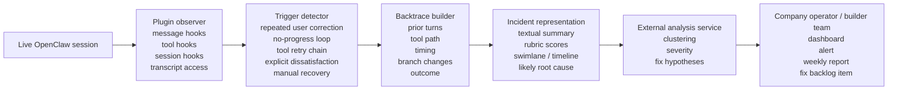

# OpenClaw Service Landscape

Context: this divergence pass explores whether there is a viable service wedge for companies running `OpenClaw-style` open flow-based personal agents. The specific question is whether OpenClaw already exposes enough extension, trace, and deployment surface to support a UX-oriented observability or incident-analysis service.

Legend:
- `Evidence-backed`: grounded in cited product docs, repos, or examples.
- `Inference`: strategic synthesis.
- `Assumption`: unverified hypothesis.

## Major Conclusions

- `Evidence-backed | confidence: high` OpenClaw is technically extensible enough for this category today. Official docs say plugins can register Gateway RPC methods, HTTP routes, agent tools, CLI commands, background services, context engines, skills, and auto-reply commands.
- `Evidence-backed | confidence: high` OpenClaw already emits the core data needed for UX-oriented incident analysis: session transcripts, message events, tool hooks, session lifecycle hooks, and persisted tool results.
- `Evidence-backed | confidence: medium` Third-party extensions already treat OpenClaw as infrastructure rather than as a closed product. The closest examples are memory plugins, telemetry bridges, workflow plugins, and ops monitors.
- `Evidence-backed | confidence: medium` The community plugin ecosystem still looks early. The official community-plugin page is small, and the known examples are infra- or memory-oriented rather than UX-analysis-oriented.
- `Inference | confidence: high` That creates whitespace for an `agent UX observability` service aimed at teams and companies running OpenClaw-based personal agents.

## What OpenClaw Exposes Today

| Surface | What the docs say | Why it matters to this wedge | Basis |
|---|---|---|---|
| Plugin registration surface | Plugins can register Gateway RPC methods, Gateway HTTP routes, agent tools, CLI commands, background services, context engines, skills, and auto-reply commands | A service plugin could both observe runtime behavior and expose its own analysis or reporting interface | `Evidence-backed` |
| In-process execution model | Plugins run in-process with the Gateway and should be treated as trusted code | This makes deep observability possible, but also raises security and trust requirements for buyers | `Evidence-backed` |
| Agent lifecycle hooks | Official agent-loop docs expose `before_tool_call`, `after_tool_call`, `tool_result_persist`, `message_received`, `message_sending`, `message_sent`, `session_start`, and `session_end` | These hooks are exactly where an incident detector or trace enricher would attach | `Evidence-backed` |
| Session transcripts | Session transcripts are stored as JSONL at `~/.openclaw/agents/<agentId>/sessions/<SessionId>.jsonl` | Structured replay and backtracing are feasible without inventing a new storage layer first | `Evidence-backed` |
| Gateway as source of truth | Official session docs say the Gateway owns state and remote mode uses the gateway host as the state source of truth | A service aimed at companies can integrate at the gateway layer rather than at every UI client | `Evidence-backed` |
| VPS and hosted deployment guides | OpenClaw documents supported VPS/cloud deployments and durable gateway-state patterns | This suggests companies can run OpenClaw as persistent infrastructure, not only as a local hobby install | `Evidence-backed` |

## Adjacent Extension Patterns Already In The Ecosystem

These examples do not solve the exact problem we want, but they prove pieces of the delivery model.

| Example | What it does | What it proves | Blind spot relative to our wedge | Basis |
|---|---|---|---|---|
| [Supermemory plugin for OpenClaw](https://github.com/supermemoryai/clawdbot-supermemory) | Auto-captures conversation turns to an external cloud memory service and injects recalled context back into OpenClaw | A third-party cloud service can plug into OpenClaw, process conversation data externally, and feed results back into agent behavior | Memory is different from UX diagnosis; it does not identify breakdowns, trust drops, or repair opportunities | `Evidence-backed` |
| [Honeycomb Telemetry Skill gist](https://gist.github.com/mrkshields/daa44b7db137f5c67d44d9600763b6d0) | Watches OpenClaw session logs and ships traces to Honeycomb | There is already appetite for observability bridges built around session logs and traces | Observability is infra-centered here, not user-experience-centered | `Evidence-backed` |
| [Memory Guardian gist](https://gist.github.com/joe-rlo/3c3193285804b05c99bbfe541ed53c4d) | Adds checkpoints, breadcrumbs, and memory safeguards around agent runs | People are experimenting with protective runtime layers around agent sessions and tool execution | The focus is memory hygiene and runtime robustness, not UX interpretation | `Evidence-backed` |
| [OpenClaw VPS Monitor gist](https://gist.github.com/rodbland2021/f71b8693c058152b5a9c7165746b1f74) | Monitors sessions, token usage, and gateway health for hosted setups | Companies running OpenClaw already want operational visibility for hosted deployments | This is ops monitoring, not incident reconstruction from the user's point of view | `Evidence-backed` |
| [OpenProse plugin](https://docs.openclaw.ai/prose) | Adds a markdown-first workflow format for orchestrated AI sessions | OpenClaw is extensible enough to host higher-level workflow systems on top of the core runtime | Workflow orchestration is not the same as user-experience analysis | `Evidence-backed` |
| [Community plugins page](https://docs.openclaw.ai/plugins/community) | Maintains a small list of community plugins that meet a quality bar | The ecosystem is open to third-party extensions, but still early and not crowded | The current list does not show a mature UX-incident-analysis category yet | `Evidence-backed` |

## What Appears Missing

- `Evidence-backed | confidence: medium` I did not find an established OpenClaw plugin or company offering:
  - live detection of misunderstandings, trust drops, manual recovery, or conversation breakdowns
  - automatic backtracing of the local conversation, tool calls, and flow events that caused the issue
  - a structured incident packet returned to the company operating the agent
- `Inference | confidence: high` The nearest existing tools are memory plugins, telemetry bridges, or general operations monitors.
- `Inference | confidence: high` That means the whitespace is not generic "OpenClaw analytics." It is an opinionated service layer that interprets traces from a UX point of view.

## Candidate Service Loop

## What The Service Would Need To Detect

These are the most promising first triggers from the current research:

- repeated user correction or reframing
- fallback loops with no goal progress
- tool failure chains and retry storms
- silent abandonment after a failed turn
- explicit dissatisfaction, distrust, or opt-out language
- user-performed repair after the agent fails
- successful recovery after a breakdown

## Good Incident Representation Options

The representation layer matters because the output must be fixable by a company, not just inspectable by a researcher.

### Textual packet

- incident title
- session and task metadata
- trigger type
- short narrative of what happened
- likely root cause layer:
  1. prompt or policy,
  2. tool choice,
  3. flow logic,
  4. interaction copy,
  5. recovery behavior
- confidence and severity
- suggested next fix

### Visual packet

- turn-by-turn timeline with timestamps
- swimlane view: `user -> agent -> tool -> result -> user reaction`
- branch or flow-transition view for where the logic diverged
- heatmap or cluster board across many incidents

### Best early combination

- `Inference | confidence: medium` The best first output is likely a compact textual incident card plus one visual timeline. That is easier to consume than a full replay and more actionable than a raw transcript.

## Why Companies Running OpenClaw Might Buy This

- `Inference | confidence: medium` If the agent is customer-facing, failures hit trust directly, not only internal developer efficiency.
- `Inference | confidence: medium` OpenClaw operators may already have raw logs, but raw logs still require painful manual interpretation.
- `Inference | confidence: medium` An external service can add leverage if it clusters incidents, normalizes patterns, and translates them into fix-ready diagnoses rather than generic telemetry.

## Key Risks

| Risk | Why it matters | Initial implication |
|---|---|---|
| Security and trust | Plugins run in-process and are trusted code; buyers may hesitate to install third-party analysis services | Early delivery may need a log-forwarding or offline-ingestion mode rather than full live plugin access |
| Privacy and consent | Conversation logs can contain sensitive personal or company data | Redaction, scoped retention, and explicit deployment models are not optional |
| Data availability varies | Some teams may not have clean flow-state traces or rich tool metadata | The first version should degrade gracefully to transcript-plus-tool hooks |
| Category education | Buyers may not yet think in terms of "agent UX observability" | Positioning will need concrete before/after incident examples |

## Fast Falsifiers

If these show up quickly, this wedge should be deprioritized:

1. OpenClaw teams say raw transcripts plus internal dashboards are already enough.
2. Security objections make plugin installation or transcript export a non-starter.
3. Operators care mainly about uptime and token cost, not experience breakdowns.
4. The strongest buyers in practice are still app-builder teams, not personal-agent operators.

## Implication For Our Overall Divergence Work

- `Inference | confidence: high` This is a credible alternate wedge, but it is still more speculative than the generated-app workflow-validation wedge.
- `Inference | confidence: medium` The strongest reason to keep it alive is not that OpenClaw already has a crowded ecosystem; it is that the extension surface is real while the UX-observability layer is still missing.

## Source Notes

- [OpenClaw Plugins docs](https://docs.openclaw.ai/plugins)
- [OpenClaw Agent Loop docs](https://docs.openclaw.ai/concepts/agent-loop)
- [OpenClaw Session Management docs](https://docs.openclaw.ai/sessions)
- [OpenClaw VPS Hosting docs](https://docs.openclaw.ai/vps)
- [OpenClaw Hetzner deployment docs](https://docs.openclaw.ai/install/hetzner)
- [OpenClaw OpenProse docs](https://docs.openclaw.ai/prose)
- [OpenClaw community plugins page](https://docs.openclaw.ai/plugins/community)
- [Supermemory OpenClaw plugin](https://github.com/supermemoryai/clawdbot-supermemory)
- [Honeycomb Telemetry Skill gist](https://gist.github.com/mrkshields/daa44b7db137f5c67d44d9600763b6d0)
- [Memory Guardian gist](https://gist.github.com/joe-rlo/3c3193285804b05c99bbfe541ed53c4d)
- [OpenClaw VPS Monitor gist](https://gist.github.com/rodbland2021/f71b8693c058152b5a9c7165746b1f74)
