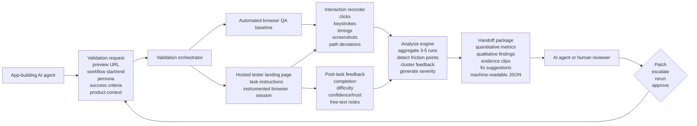

# Workflow Validation Thesis

Framing: this document turns the current lead wedge into a more concrete operating thesis. The idea is not just "run usability tests," but to create a fast workflow-validation loop that app-building agents can call on demand.

Legend:
- `Evidence-backed`: grounded in existing market or workflow evidence.
- `Inference`: strategic synthesis.
- `Assumption`: unverified hypothesis.

## Working Thesis

- `Inference | confidence: high` If app-building agents can already generate preview URLs, feature requirements, and workflow definitions, then a validation system can sit directly after build generation and before release.
- `Inference | confidence: high` The most credible first product is not a broad research suite. It is a `workflow completion plus post-task feedback loop` for specific user journeys.
- `Assumption | confidence: medium-low` In many early-stage cases, `3-5` strong workflow runs with both telemetry and post-task feedback will be enough to produce useful diagnosis, even if they are not enough for statistical certainty.
- `Inference | confidence: high` The key handoff is not just raw recordings. It is a structured package that the AI agent can act on: what failed, where, why it likely failed, and what to change next.

## High-Level System Diagram

## Workflow Narrative

1. The app-building agent submits a validation request with a preview link, target workflow, desired end state, and the relevant user context.
2. The system first runs an automated browser QA baseline to confirm the task is at least mechanically possible.
3. If the baseline is viable, the workflow is exposed through a hosted tester surface where human or synthetic users can attempt the task.
4. Every run captures structured interaction telemetry, plus a short post-task rating and qualitative note.
5. After a small number of runs, the system aggregates the results into a diagnosis package.
6. The output is returned in a form the AI agent can use directly, and in a form a human reviewer can sanity-check quickly.

## Core Components

| Component | Job to be done | Why it matters | Basis |
|---|---|---|---|
| Validation request API | Accept preview URL, workflow, persona, and success criteria from the app-building agent | Makes the system agent-callable instead of human-dashboard-first | `Inference` |
| Preview host / session manager | Load the generated app or workflow in a stable, testable environment | Without reliable hosting, both QA and usability evidence break down | `Inference` |
| Automated browser baseline | Confirm the flow is technically completable before asking humans to try it | Prevents wasting human runs on obviously broken workflows | `Inference` |
| Tester landing page | Present available tasks and instructions to end users or panelists | Creates the clean entry point for real workflow trials | `Assumption` |
| Interaction recorder | Capture clicks, keystrokes, timings, missteps, and screen evidence | Converts behavior into diagnosable evidence, not just anecdote | `Inference` |
| Post-task feedback collector | Ask for task rating, confidence, friction, and open notes | Objective completion is not enough; sentiment and trust matter too | `Inference` |
| Analysis engine | Turn a small number of runs into prioritized insight | This is where raw evidence becomes useful to the agent | `Inference` |
| Handoff package generator | Return structured issues, evidence, and next actions | The AI agent needs an actionable contract, not only a report | `Inference` |

## What To Measure

### Objective workflow signals

- completion or non-completion
- time on task
- number of backtracks
- dead ends or failed states
- misclicks or repeated actions
- form validation or navigation breakdowns

### Subjective workflow signals

- perceived difficulty
- confidence or trust after task completion
- clarity of the next step
- willingness to use the flow again
- open-text explanation of where the user got confused

### Evidence artifacts

- replay or event timeline
- screenshot at the moment of confusion
- quoted user comment
- step-level failure tag
- suggested fix direction

## Handoff Contract Back To The AI Agent

The return object should likely include both machine-readable and human-readable layers.

### Machine-readable layer

- workflow ID
- completion rate across runs
- median time on task
- top friction steps
- severity per issue
- evidence links
- fix hypotheses
- rerun recommendation

### Human-readable layer

- one short summary
- top 3-5 issues
- what users expected versus what happened
- confidence level of the analysis
- whether to patch, escalate, or approve

## Why This Is A Strong First Slice

- `Inference | confidence: high` It is narrower than a full UX research platform, but broader than a brittle QA checker.
- `Inference | confidence: high` It uses the app-building agent's existing artifacts: preview link, task definition, and requirements.
- `Inference | confidence: medium` It creates a natural loop between automated testing and human judgment instead of forcing an all-or-nothing choice.
- `Assumption | confidence: medium-low` It may create a better entry point than "synthetic user testing" because it starts with concrete workflow validation rather than abstract research language.

## Key Risks

| Risk | Why it matters | Mitigation |
|---|---|---|
| Too much setup per workflow | Agents may not provide enough context | Keep the request schema minimal and test what the minimum viable inputs really are |
| Weak sample size | Three to five runs can mislead if overinterpreted | Treat early runs as diagnostic, not statistically definitive |
| Hosted environment complexity | Preview links, auth, and state setup can become the real work | Start with simple public or staging flows before complex authenticated products |
| Human feedback quality variance | Poor participants or weak instructions can corrupt signal | Keep tasks narrow and enforce short, structured post-task prompts |
| Agent handoff ambiguity | The AI agent may get a report but not know what to do next | Make the output contract explicit: patch, rerun, escalate, or approve |

## Not In Scope For This Thesis

- Full-panel management or full-service research ops
- Large-sample quantitative studies
- General-purpose product analytics
- Full observability across every workflow in a production app

## What This Sharpens In The Current Strategy

- `Inference | confidence: high` The lead wedge is best understood as `workflow validation for AI-generated apps`, not just generic synthetic UX testing.
- `Inference | confidence: medium` The strongest loop may be:
  `agent submits flow -> browser baseline verifies -> users attempt flow -> system synthesizes -> agent patches -> rerun`
- `Assumption | confidence: medium-low` The first UI may not need to be a broad dashboard at all. It may only need:
  1. a request surface for the agent or operator,
  2. a hosted task page for testers,
  3. a results packet returned to the builder.
